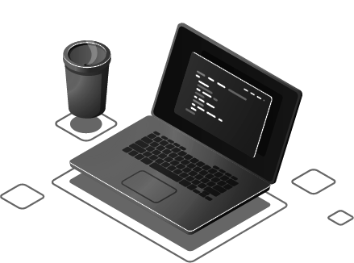

# 👋 Olá, eu sou Juan!

<table>
  <tr>
    <td width="65%" valign="top">

💻 Estudante de programação

🚀 Aprendendo desenvolvimento de software

🎯 Meu objetivo é me tornar um desenvolvedor profissional 👊

</td>
<td width="35%" align="center">
  
</td>

  </tr>
</table>

---

## 🧑‍💻 Sobre mim

* 🎓 Cursando Técnico em Informática para Internet no Instituto SENAI
* 🎓 Cursando Inglês na plataforma Kultivi
* 🎓 Cursando o 3º ano do ensino médio
* 🎓 Sou vestibulando e estou me preparando para ingressar em Engenharia de Software

---

## 💻 Habilidades

 

### Ferramentas

| Ferramenta      | Nível         |
| --------------- | ------------- |
| Git             | Intermediário |
| GitHub          | Intermediário |
| VS Code         | Intermediário |
| PyCharm         | Intermediário |
| MySQL Workbench | Intermediário |
| Figma           | Intermediário |
| draw.io         | Intermediário |
| BRModelo        | Intermediário |
| Render          | Intermediário |
| Markdown        | Intermediário |
| Canva           | Intermediário |
| Word            | Intermediário |
| Excel           | Intermediário |

---

## 📚 Cursos

📚 Ver cursos e certificações

| **Curso**                                              | **Instituição**         | **Carga Horária** | **Conclusão**  |
| ------------------------------------------------------ | ----------------------- | ----------------- | -------------- |
| **Fundamentos da Análise de Dados**                    | **SENAI-DF/Taguatinga** | **30 horas**      | **31/10/2025** |
| **Soluções de IA no GitHub**                           | **Fundação Bradesco**   | **15 horas**      | **03/07/2026** |
| **Linguagem de Programação Python - Básico**           | **Fundação Bradesco**   | **18 horas**      | **02/03/2026** |
| **Administrando Banco de Dados**                       | **Fundação Bradesco**   | **15 horas**      | **18/05/2026** |
| **Fundamentos de TI: Hardware e Software**             | **Fundação Bradesco**   | **7 horas**       | **27/02/2026** |
| **Crie um site simples usando HTML, CSS e JavaScript** | **Fundação Bradesco**   | **2 horas**       | **15/04/2026** |
| **Letramento Digital**                                 | **Fundação Bradesco**   | **4 horas**       | **08/04/2026** |
| **Fundamentos do Design Gráfico**                      | **Fundação Bradesco**   | **6 horas**       | **18/03/2026** |
| **FluencIA**                                           | **Fundação Bradesco**   | **4 horas**       | **04/05/2026** |
| **Excel na Prática**                                   | **Fundação Bradesco**   | **16 horas**      | **03/02/2026** |
| **Introdução à Administração**                         | **Fundação Bradesco**   | **12 horas**      | **16/03/2026** |
| **Educação Financeira**                                | **Fundação Bradesco**   | **4 horas**       | **22/05/2026** |
| **Microsoft Word 2016 - Básico**                       | **Fundação Bradesco**   | **9 horas**       | **09/02/2026** |
| **Microsoft Word 2016 - Intermediário**                | **Fundação Bradesco**   | **12 horas**      | **04/03/2026** |
| **Microsoft Word 2016 - Avançado**                     | **Fundação Bradesco**   | **8 horas**       | **22/06/2026** |
| **Microsoft Excel 2016 - Básico**                      | **Fundação Bradesco**   | **15 horas**      | **16/03/2026** |
| **Microsoft Excel 2016 - Intermediário**               | **Fundação Bradesco**   | **20 horas**      | **06/04/2026** |
| **Microsoft PowerPoint 2016 - Básico**                 | **Fundação Bradesco**   | **8 horas**       | **09/03/2026** |
| **Microsoft PowerPoint 2016 - Avançado**               | **Fundação Bradesco**   | **8 horas**       | **06/04/2026** |

## Estatísticas

